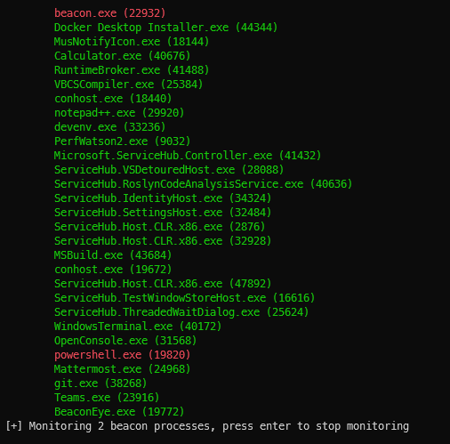

# BeaconEye

## Introduction

BeaconEye scans running processes for active CobaltStrike beacons.  When processes are found to be running beacon, BeaconEye will monitor each process for C2 activity.



## How it works

BeaconEye will scan live processes or MiniDump files for suspected CobaltStrike beacons.  In live process mode, BeaconEye optionally attaches itself as a debugger and will begin monitoring beacon activity for C2 traffic (HTTP/HTTPS beacons supported currently).

The AES keys used for encrypting C2 data and mallable profile are decoded on the fly, which enables BeaconEye to extract and decrypt beacon's output when commands are sent via the operator.

A log folder of activity is created per process relative to the current directory where BeaconEye is executed from.

## Usage

```shell
BeconEye by @_EthicalChaos_
  CobaltStrike beacon hunter and command monitoring tool x86_64

  -v, --verbose              Display more verbose output instead of just
                               information on beacons found
  -m, --monitor              Attach to and monitor beacons found when scanning
                               live processes
  -f, --filter=VALUE         Filter process list with names starting with x (
                               live mode only)
  -d, --dump=VALUE           A folder to use for MiniDump mode to scan for
                               beacons (files with *.dmp or *.mdmp)
  -h, --help                 Display this help
```

## Features

* A per process log folder
* Dumps beacon config
* Displays output from most beacon commands
* Saves screenshots
* Detects standalone and injected beacons
* Detects beacons masked with built in `sleep_mask`
* Scan running processes or Minidumps offline

## Caveats

BeaconEye can detect all beacon types but only monitor HTTP/HTTPS beacons.  At present, only command output is decoded and not command requests. See TODO list below for a full list of intended features.

BeaconEye should be considered **ALPHA**, I'm keen to get feedback on 4.x beacons that cannot be detected or where the malleable C2 profile has not been parsed correctly resulting in incorrect decoding of output.

## TODO

* ~~Implement 32bit beacon monitoring~~
* Add support for monitoring named pipe beacons
* Add support for monitoring TCP beacons
* Add support for CobaltStrike 3.x
* ~~Add command line argument for targeting specific processes~~
* Add command line argument to specify output logging location
* Add support for extracting operator commands
* ~~Support scanning MiniDump files~~


## References and Thanks

* BeaconEye's initial beacon process detection is heavily based on @Apr4h's [CobaltStrikeScan](https://github.com/Apr4h/CobaltStrikeScan).
* James Forshaw's NtApiDotNet library, which makes process deubgging and interaction a breeze from C#.
* @cube0x0 for his port of a pure managed C# MiniDump reader which was used as a reference. 
